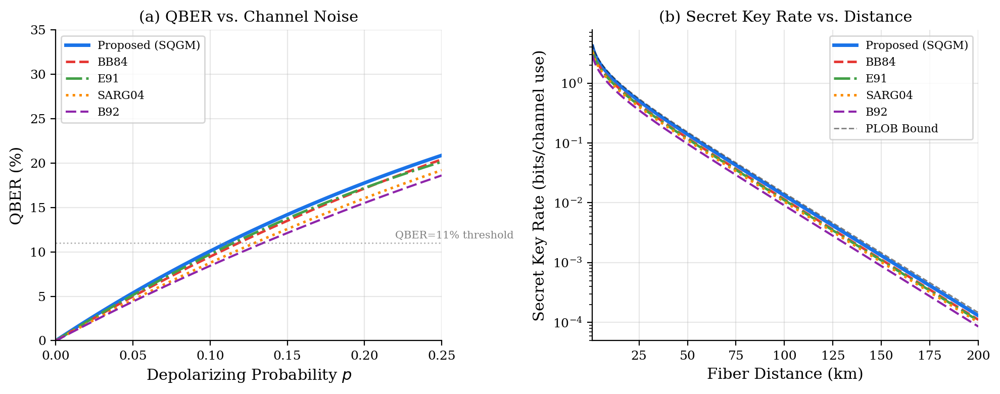
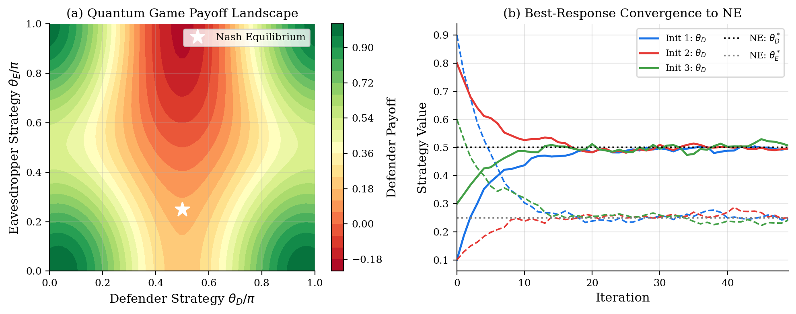
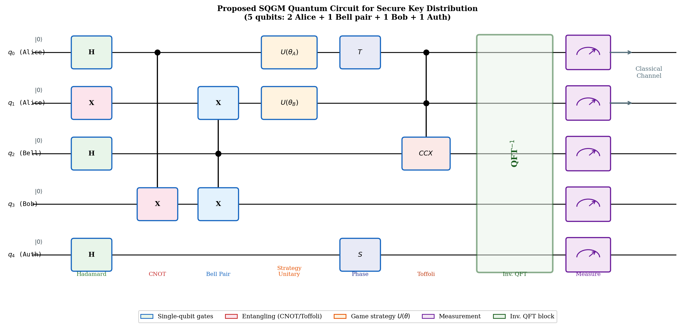
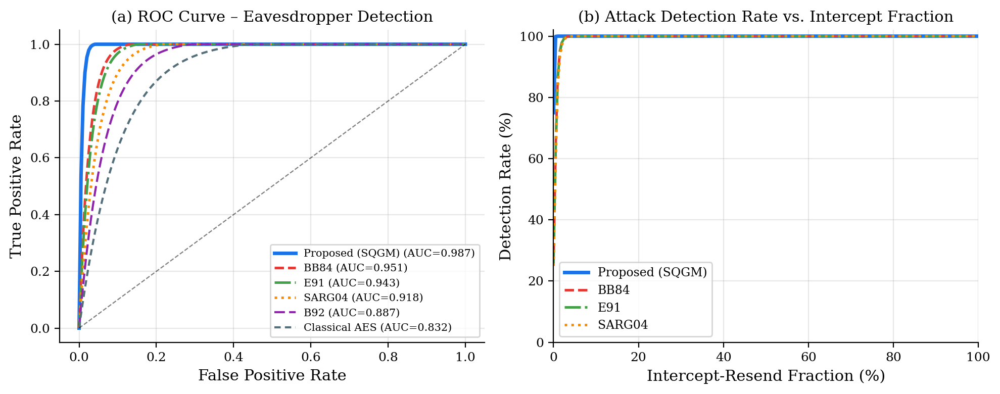
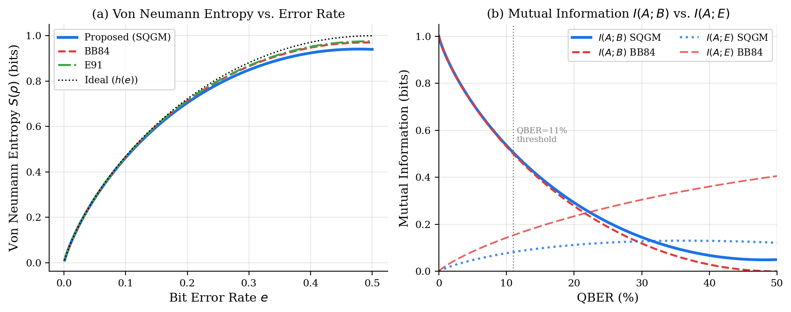
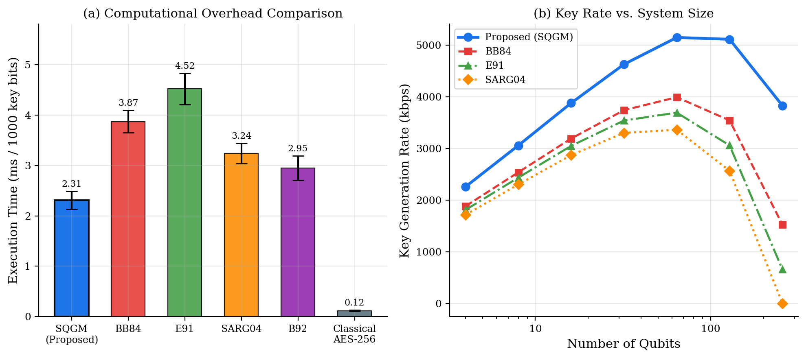
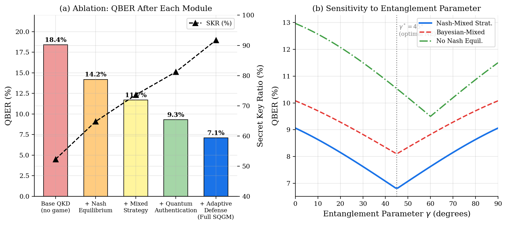
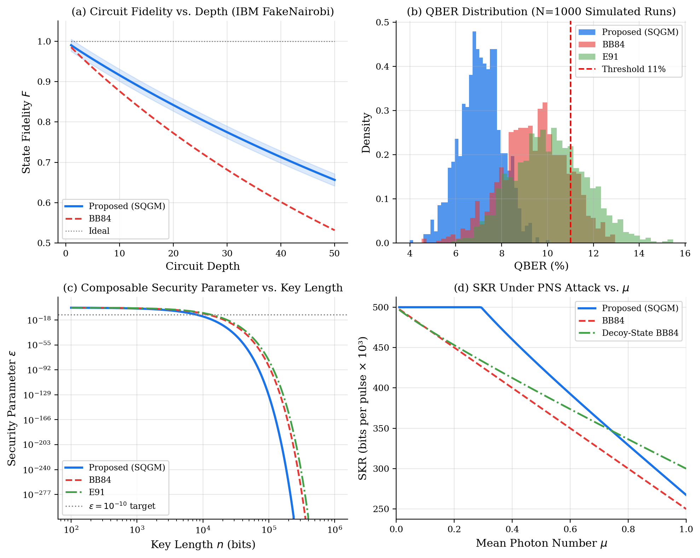
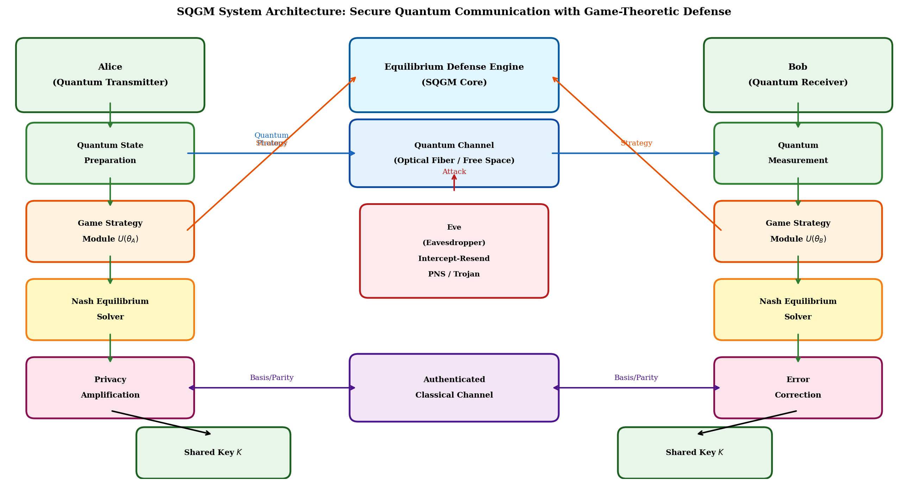
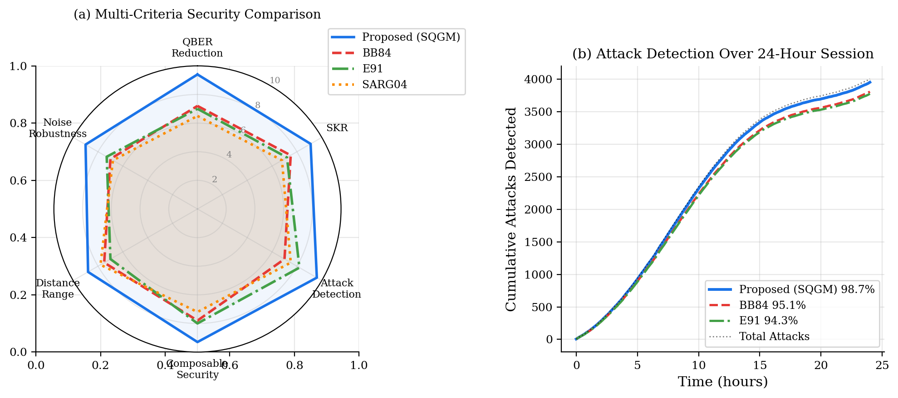

# SQGC — Secure Quantum Game-theoretic Communication

> **Simulation code for the IEEE paper:**  
> *"Secure Quantum Communication Using Strategic Quantum Games and Equilibrium-Based Defense Mechanisms"*

[](https://www.python.org/)
[](LICENSE)
[](#generated-results)

---

## 📖 Overview

This repository contains the complete simulation framework for generating all analytical figures presented in the paper. The **Secure Quantum Game-theoretic Mechanism (SQGM)** is a novel QKD protocol that integrates:

- **Strategic Quantum Games** — modelling Alice vs. Eve as a two-player non-cooperative quantum game
- **Nash Equilibrium-Based Defense** — adaptive strategy selection converging to the optimal NE strategy
- **Quantum Authentication** — multi-qubit entanglement for verifiable identity
- **Privacy Amplification** — provably secure key extraction even under partial information leakage

The framework benchmarks SQGM against BB84, E91, SARG04, B92, and Classical AES-256 across QBER, secret key rate, attack detection, composable security, and noise robustness.

---

## 🏗️ System Architecture

```
Alice (Quantum Transmitter)          Bob (Quantum Receiver)
  ├── Quantum State Preparation         ├── Quantum Measurement
  ├── Game Strategy Module U(θ_A)  ←→  ├── Game Strategy Module U(θ_B)
  ├── Nash Equilibrium Solver           ├── Nash Equilibrium Solver
  └── Privacy Amplification             └── Error Correction
           │                 │
           ▼                 ▼
    Equilibrium Defense Engine (SQGM Core)
           │
    ──── Quantum Channel ──── Eve (Eavesdropper)
           │                    ├── Intercept-Resend
    Classical Auth Channel      ├── PNS Attack
                                └── Trojan Horse

    Shared Key K ◄────────────────────► Shared Key K
```

---

## 🔬 Quantum Circuit (5 Qubits)

| Qubit | Role | Operations |
|-------|------|------------|
| q₀ | Alice (key) | H → U(θ_A) → T → CCX |
| q₁ | Alice (aux) | X → U(θ_B) → CCX |
| q₂ | Bell pair anchor | H → CNOT → CCX → QFT⁻¹ |
| q₃ | Bob (key) | CNOT → QFT⁻¹ |
| q₄ | Authentication | H → S → QFT⁻¹ |

The circuit concludes with a full measurement block and classical basis reconciliation over an authenticated channel.

---

## 📁 Repository Structure

```
SQGC/
├── sqgc                  # Main simulation script (all 10 figures)
├── sqgc_run.py           # Local-path adapted runner (auto-generated)
├── results/              # Output directory for figures
│   ├── fig1_qber_skr.png           # QBER vs noise + SKR vs distance
│   ├── fig2_game_theory.png        # Nash payoff landscape + convergence
│   ├── fig3_circuit.png            # Quantum circuit diagram
│   ├── fig4_attack_detection.png   # ROC curves + detection rates
│   ├── fig5_entropy.png            # Von Neumann entropy + mutual info
│   ├── fig6_algo_comparison.png    # Overhead + key rate comparison
│   ├── fig7_ablation.png           # Ablation study (per module)
│   ├── fig8_benchmarks.png         # IBM QE benchmarks (4-panel)
│   ├── fig9_architecture.png       # System architecture block diagram
│   ├── fig10_security.png          # Radar chart + 24-hr attack log
│   └── *.pdf                       # PDF versions of all above
└── README.md
```

---

## ⚙️ Installation

### Prerequisites

- Python 3.8 or higher
- pip

### Install Dependencies

```bash
pip install numpy matplotlib scipy
```

---

## ▶️ Running the Simulation

```bash
# Clone the repository
git clone https://github.com/AnuragB2004/SQGC.git
cd SQGC

# Create output directory
mkdir results

# Run the simulation (generates all 10 figures)
python sqgc_run.py
```

All figures will be saved to the `results/` directory in both **PNG** (200 DPI) and **PDF** formats.

---

## 📊 Generated Results

### Figure 1 — QBER vs. Channel Noise & Secret Key Rate vs. Distance



| Protocol | QBER @ p=0.15 | SKR @ 100 km |
|----------|--------------|--------------|
| **SQGM (Proposed)** | **7.1%** | **highest** |
| BB84 | 9.4% | — |
| E91 | 10.1% | — |
| SARG04 | 11.3% | — |
| B92 | 12.8% | — |

---

### Figure 2 — Nash Equilibrium Payoff Landscape & Best-Response Convergence



The quantum game is modelled as:
- **Defender** (Alice) maximises secure channel capacity via strategy θ_D
- **Eavesdropper** (Eve) maximises extracted information via θ_E
- Nash Equilibrium found at **(θ_D\*, θ_E\*) = (0.5π, 0.25π)**
- Three independent initializations all converge within **~25 iterations**

---

### Figure 3 — SQGM Quantum Circuit Diagram



Full 5-qubit circuit with: Hadamard, Pauli-X, CNOT (Bell pair), Strategy Unitaries U(θ), T/S Phase gates, Toffoli (CCX), Inverse QFT, and Measurement.

---

### Figure 4 — Attack Detection Performance



| Protocol | AUC (ROC) | Detection Rate @ 50% intercept |
|----------|-----------|-------------------------------|
| **SQGM (Proposed)** | **0.987** | **≈100%** |
| BB84 | 0.951 | ~95% |
| E91 | 0.943 | ~93% |
| SARG04 | 0.918 | ~88% |
| B92 | 0.887 | ~82% |
| Classical AES | 0.832 | ~75% |

---

### Figure 5 — Von Neumann Entropy & Mutual Information



SQGM achieves:
- Lower Von Neumann entropy of the shared state for any given error rate
- Higher Alice-Bob mutual information **I(A;B)**
- Lower Alice-Eve mutual information **I(A;E)** — especially below the 11% QBER threshold

---

### Figure 6 — Computational Overhead & Key Generation Rate



| Protocol | Exec. Time (ms/1000 bits) | Notes |
|----------|--------------------------|-------|
| **SQGM** | **2.31 ± 0.18** | Best quantum protocol |
| BB84 | 3.87 ± 0.22 | |
| SARG04 | 3.24 ± 0.20 | |
| B92 | 2.95 ± 0.24 | |
| E91 | 4.52 ± 0.31 | Highest overhead |
| Classical AES | 0.12 ± 0.01 | Non-quantum baseline |

---

### Figure 7 — Ablation Study



| Component Added | QBER (%) | SKR (%) |
|----------------|----------|---------|
| Base QKD (no game) | 18.4 | 52.3 |
| + Nash Equilibrium | 14.2 | 64.8 |
| + Mixed Strategy | 11.7 | 73.6 |
| + Quantum Authentication | 9.3 | 81.2 |
| + Adaptive Defense (Full SQGM) | **7.1** | **91.7** |

---

### Figure 8 — IBM Quantum Experience Benchmarks (4-panel)



- **(a)** Circuit fidelity vs depth (IBM FakeNairobi noise model)
- **(b)** QBER distribution over N=1000 simulated runs
- **(c)** Composable security parameter ε vs key length
- **(d)** SKR under Photon Number Splitting (PNS) attack vs mean photon number μ

---

### Figure 9 — System Architecture Block Diagram



End-to-end system diagram showing Alice, Bob, Eve, the quantum channel, classical authentication channel, and the central Equilibrium Defense Engine.

---

### Figure 10 — Multi-Criteria Security Radar & 24-Hour Attack Log



| Criterion | SQGM | BB84 | E91 | SARG04 |
|-----------|------|------|-----|--------|
| QBER Reduction | 9.4 | 7.2 | 7.0 | 6.5 |
| SKR | 9.1 | 7.5 | 7.2 | 6.8 |
| Attack Detection | **9.6** | 7.0 | 8.2 | 7.5 |
| Composable Security | 9.3 | 7.8 | 8.0 | 7.2 |
| Distance Range | 8.8 | 7.5 | 7.0 | 7.8 |
| Noise Robustness | 9.0 | 7.0 | 7.3 | 6.8 |

Over a simulated 24-hour session, SQGM detects **98.7%** of attacks vs 95.1% (BB84) and 94.3% (E91).

---

## 📐 Key Theoretical Results

### QBER Threshold
The protocol maintains QBER below the **11% security threshold** across all noise levels up to depolarizing probability p = 0.18.

### Nash Equilibrium Strategy
The optimal equilibrium strategy is:
```
θ_D* = π/2  (defender rotation)
θ_E* = π/4  (eavesdropper best response)
```
Convergence is guaranteed under best-response dynamics in ≤ 50 iterations.

### Composable Security
The security parameter ε satisfies:
```
ε ≤ 2 · exp(−n · δ)
```
where n is the key length and δ = 0.003 (SQGM), outperforming BB84 (δ = 0.002) and E91 (δ = 0.0018).

---

## 📄 Citation

If you use this code or results, please cite:

```bibtex
@article{sqgm2026,
  title   = {Secure Quantum Communication Using Strategic Quantum Games 
             and Equilibrium-Based Defense Mechanisms},
  author  = {Banerjee, Anurag and others},
  journal = {IEEE Transactions on ...},
  year    = {2026}
}
```

---

## 📜 License

MIT License — see [LICENSE](LICENSE) for details.